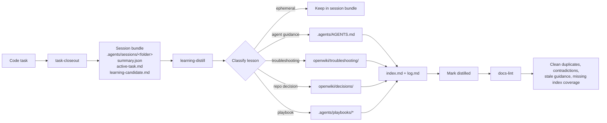

# Agent Knowledge Starter Kit v2.0

A shareable, tool-agnostic starter kit for maintaining a compiled repo knowledge layer for coding agents.

Durable decisions and troubleshooting patterns live as curated OKF pages under `openwiki/decisions/` and `openwiki/troubleshooting/`, indexed by OpenWiki tooling.

This pattern separates three concerns:

1. **Temporary session outputs** live inside the repo under `.agents/sessions/`, with one folder per task-closeout bundle.
2. **Durable repo knowledge** lives under `.agents/`.
3. **Agent roles and skills** live in that same `.agents/` tree and describe how coding, learning, and maintenance workflows run.

Important: in this repository, adoption is skill/bootstrap-first. Install the kit skills with your Skills CLI and run each skill's **Skill initialization** once so the repo gains only the folders and template files needed for the installed skills. Default `npx skills add` often places skills under `.agents/skills/`; user or global installs are fine too—session bundles and durable knowledge still belong under this repo’s `.agents/`. Details: [INSTALL.md](INSTALL.md#skill-first-install-default).

The goal is to avoid bloating a single `.agents/AGENTS.md` with temporary notes, while still preserving useful lessons from completed work.

## Disclaimer

This repository and the kit under `.agents/` were produced with the help of AI tools. Everything here is **as-is**; **use at your own risk**. Validate instructions, commands, and policies for your environment before relying on them.

## Why this exists

Most coding agents can edit code well enough, but repo learning often degrades into one of two bad outcomes:

- useful lessons are lost after the session ends
- too much low-quality context gets stuffed into instruction files

This starter kit introduces a small maintenance system:

- a **coding agent** finishes work and emits a structured handoff packet
- a **learning agent** distills only the durable parts into `.agents/`
- an optional **lint agent** keeps the knowledge layer coherent over time

This is intentionally generic. It should work with any system that supports user-defined agents or personas, reusable skill or instruction files, full repo file access, and a **gitignored** `.agents/sessions/` area for temporary task artifacts.

## Quick start

### Which setup step do I need?

`aksk-bootstrap` and `aksk-init` cover different scopes. You often need only one of them:

| Situation | Run |
| --- | --- |
| New machine or new user (first time on this host) | `aksk-bootstrap` — global, once per user: `npm i -g` for openspec/openwiki plus global skills (incl. `openspec-*`). |
| New or existing repo on an already-bootstrapped machine | `aksk-init` only — per-repo: scaffold `.agents/` + `AGENTS.md` baseline, then openspec/openwiki init, routing/lifecycle, wiki contract. Re-running bootstrap here is harmless but unnecessary (it is idempotent). |
| This starter-kit repo itself | Either lane is a safe idempotent refresh — the kit dogfoods its own init (tracked `openwiki/`, `openspec/`, attached contract confirm it). Don't scaffold *from* it as if it were a consumer template; the distributable contract is what the skills install. |

`aksk-bootstrap` owns global setup; `aksk-init` owns per-repo setup. See [INSTALL.md](INSTALL.md) for overrides.

### A note on `-a <agent>` and `--all`

- `-a` takes your Skills-CLI host id (e.g. `opencode`, `codex`, `claude`); use `'*'` only when you mean every integration. Confirm what landed with `npx skills list -g`.
- `--all` is shorthand for `--skill '*' --agent '*' -y`: it installs **every** skill into **every** agent integration the CLI knows about — many product-specific directories, not just `~/.agents/skills/`. Prefer `-a <one-agent>` (e.g. `-a opencode`) for a minimal tree; use `--all` only when you intend that wide layout.
- These host ids are Skills-CLI integration names, not local binary names. (There is no `pi` command — the binary on PATH is `prime-agent`, which reads skills via its `~/.pi/agent/skills` symlinks.)

### Ask your agent to install (preferred)

Give your agent this prompt:

```text
Install the Agent Knowledge Starter Kit into this repo:

1. npx skills add Hypercubed/Agent-Knowledge-Starter-Kit -g -a <agent>
   (or npx skills add <path-to-kit> -g -a <agent> with a local checkout; no `#develop` suffix needed — `main` now carries the merged v2.0 and is byte-identical to `develop`, so pinning `#develop` only risks future divergence)
   <agent> is your host id — opencode, codex, claude (confirm with `npx skills list -g`); `-g --all` (shorthand for `--skill '*' --agent '*' -y`) installs every skill into every agent integration, so prefer `-a <one-agent>` unless you intend the wide layout; positional <source> must come first — npx skills add -g -a <source> fails with Missing required argument: source; npx required; this installs all skills)
   e.g. npx skills add Hypercubed/Agent-Knowledge-Starter-Kit -g -a opencode
2. New machine/user? Run the aksk-bootstrap skill (global: npm i -g for openspec/openwiki, global skills incl. `openspec-*`). Already bootstrapped? Skip to 3.
3. Then run the aksk-init skill (per-repo: scaffold .agents/ + AGENTS.md baseline first, then openspec/openwiki init, routing/lifecycle, wiki contract). In the kit repo itself this is a safe no-op refresh (it dogfoods the same lane).

See INSTALL.md for overrides. aksk-bootstrap owns global setup; aksk-init owns per-repo setup.
```

### Manual install

From the target repo:

```bash
npm i -g @fission-ai/openspec openwiki
npx skills add Hypercubed/Agent-Knowledge-Starter-Kit#develop -g  # add #develop until v2.0 is published; positional <source> must come first
# or: npx skills add <path-to-kit> -g  # local checkout, installs all skills
```

Add `-a <your-agent>` (e.g. `-a codex`) if you also want the host-specific mirror alongside `~/.agents/skills`.

Then run `aksk-init` — via the skill (interactive) or the script:

```bash
node ~/.agents/skills/aksk-init/scripts/bootstrap-repo.mjs [repo-root]
```

See [INSTALL.md](INSTALL.md) for overrides and [`.agents/skills/aksk-init/SKILL.md`](.agents/skills/aksk-init/SKILL.md) for the full contract.

## How to use this kit

Use the kit as a lightweight maintenance loop around normal agent work:

1. **Start with the repo knowledge layer.** Keep a short root `AGENTS.md` or tool rule that points agents to `.agents/AGENTS.md` and `openwiki/index.md` (the kit's `AKSK:ROUTING` block does this; attach it with `attach_section.mjs`). Put durable repo policy in `.agents/`, not in each tool's native config.
2. **Do the implementation work normally.** Have the coding agent read the relevant durable guidance, use playbooks, or curated pages under `openwiki/troubleshooting/` when needed, and keep tool-specific prompts as thin wiring.
3. **Close meaningful tasks with `task-closeout`.** At completion, blockage, or abandonment, invoke the repo-local `task-closeout` skill. It should write raw evidence and a structured bundle under `.agents/sessions/<folder>/`, which is usually gitignored. The canonical task/session identifier is the `task_id` field inside that bundle's `summary.json`; the folder name is only a sortable storage label.
4. **Promote durable lessons with `learning-distill`.** After closeout, run a separate learning pass with `learning-distill`. Pass the session bundle path and use the `task_id` field in `summary.json` when referring to the task. Promote only stable, reusable lessons into `.agents/AGENTS.md`, the curated wiki trees, or `.agents/playbooks/`. Leave one-off task history in `.agents/sessions/`.
5. **Keep the knowledge layer clean with `docs-lint`.** Periodically invoke `docs-lint` to find duplicate, stale, contradictory, oversized, or uncategorized guidance before the layer becomes noisy.
6. **Review the diff.** Treat durable knowledge changes like code: inspect what changed, make sure session bundles stayed temporary, and commit only the files that should become shared repo knowledge.



Tool-specific guides in [`docs/integrations/`](docs/integrations/) show how to wire this same workflow into individual products.

Repo-local session storage is the default because bundles stay close to the code, diffs, commands, and durable docs they describe. In cloud, ephemeral, or shared-agent environments, adapt the storage location if local `.agents/sessions/` data may disappear or cross machine boundaries. Keep per-task session artifacts out of commits, either with the kit's `.agents/.gitignore` or equivalent repo-root ignore rules.

## Adopting into an existing `.agents/`

Do not replace an existing `.agents/` tree wholesale unless it is already disposable template content. Preserve repo-specific knowledge first, especially existing `rules/`, `playbooks/`, and `skills/`, then merge in the missing starter-kit pieces.

Use this checklist:

1. Inventory existing `.agents/` content and mark domain-specific files to keep.
2. Install the skills you need with `npx skills add Hypercubed/Agent-Knowledge-Starter-Kit` (or copy selected skill folders from `.agents/skills/`) and run each skill's **Skill initialization** so missing template files and session layout are created without overwriting existing content.
3. Add the portable maintenance skills if they are not already present: `task-closeout`, `learning-distill`, and `docs-lint`.
4. Merge `.agents/AGENTS.md` by hand so stable repo guidance stays concise and temporary history stays out.
5. Confirm session ignore rules. Prefer the kit default in `.agents/.gitignore`: `sessions/*` and `!sessions/README.md`. Use repo-root `.gitignore` patterns only as an alternative: `.agents/sessions/*` and `!.agents/sessions/README.md`.
6. Record any durable rationale as a curated page under `openwiki/decisions/` (per the learning-distill contract).
7. Run `node .agents/skills/aksk-bootstrap/scripts/sync_wiki_indexes.mjs` so wiki indexes surface pre-existing repo-specific `rules/`, `playbooks/`, and `skills/` knowledge.

If both root `AGENTS.md` and `.agents/AGENTS.md` exist, treat root `AGENTS.md` as the agent entrypoint for that checkout and `.agents/AGENTS.md` as the portable knowledge-layer file. Keep one source of truth for each instruction: root `AGENTS.md` should point agents into `.agents/` or contain only bootstrap guidance, while durable repo conventions live in `.agents/AGENTS.md`.

## Architecture

Design principles, repository layout, agent roles, durable knowledge files, task lifecycle, and distillation rules live in [docs/architecture.md](docs/architecture.md).

## Tool integration

This kit ships **content** (markdown, layout, and conventions), not a single vendor-specific config. You still need to register `.agents/skills/*/SKILL.md` however your stack expects. Keep the on-disk layout under `.agents/` stable so the knowledge layer stays portable when you change tools.

## Integrations

Tool-specific integration guides live in [`docs/integrations/`](docs/integrations/). Start with the shared [Integration Patterns](docs/integrations/patterns.md) guide, then use the product-specific quick reference for exact setup details.

Currently available:

- [Integration Patterns](docs/integrations/patterns.md)
- [Agentic Sandbox](docs/integrations/agentic-sandbox.md)
- [Antigravity](docs/integrations/antigravity.md)
- [Claude Code](docs/integrations/claude-code.md)
- [Codex](docs/integrations/codex.md)
- [Copilot](docs/integrations/copilot.md)
- [Cursor](docs/integrations/cursor.md)
- [Gemini CLI](docs/integrations/gemini-cli.md)
- [Hermes](docs/integrations/hermes.md)
- [Kilo Code](docs/integrations/kilo-code.md)
- [OpenClaw](docs/integrations/openclaw.md)
- [OpenCode](docs/integrations/opencode.md)
- [Warp](docs/integrations/warp.md)
- [Zo Computer](docs/integrations/zo-computer.md)

---

## License

Released under the [MIT License](LICENSE).
